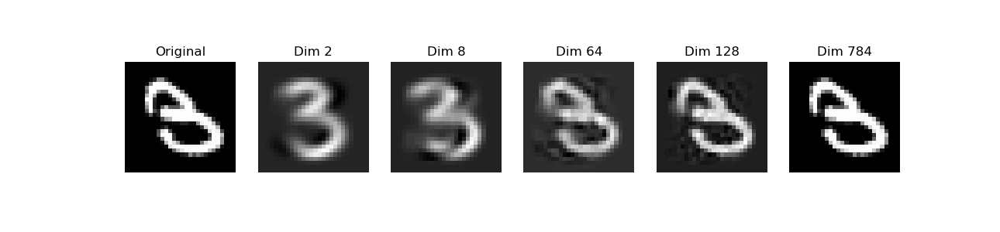
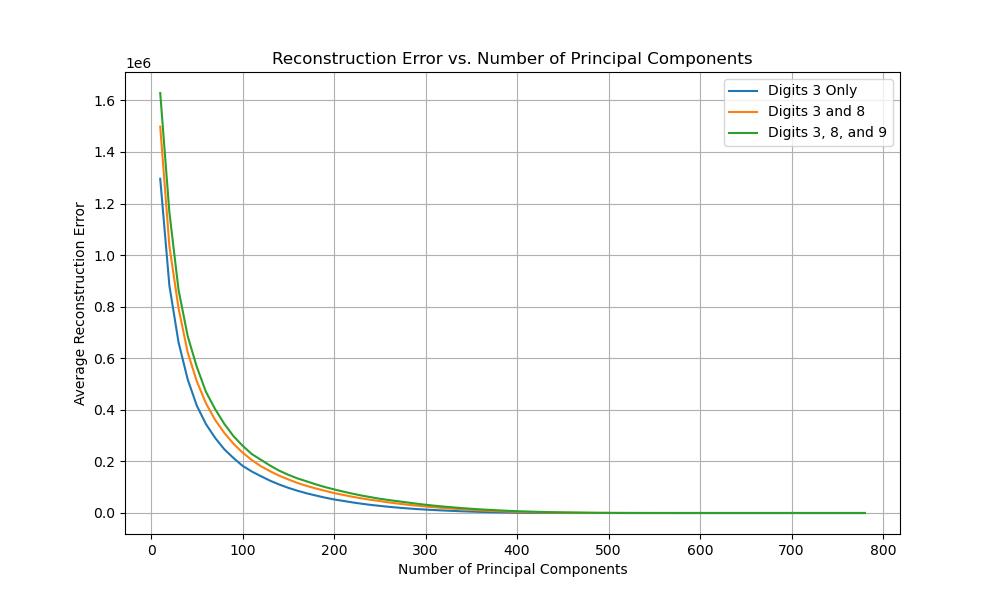

## Conclusion

• Dimensionality Reduction:  

As the number of principal components increases, the reconstruction error decreases, indicating that more variance from the original data is captured.  

• Dataset Diversity Impact:  

  Including more digits in the PCA computation introduces more variability, leading to higher reconstruction errors for digit 3 images when using PCA models computed from mixed digits.  

